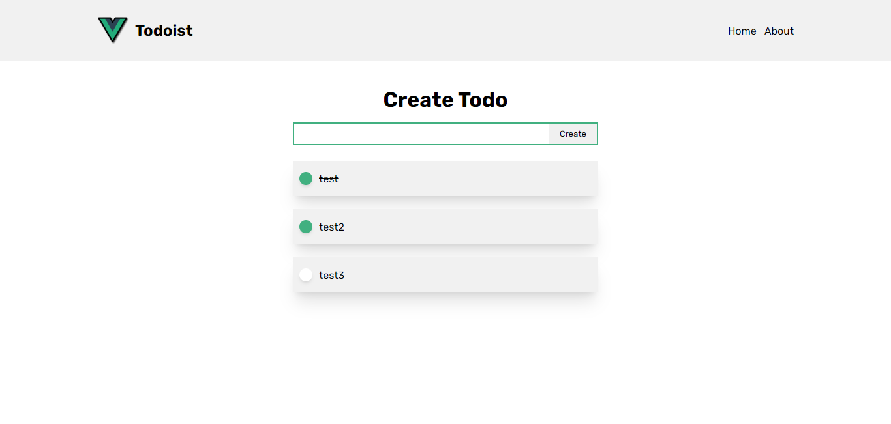

##### Table of Contents

[Links](#links)  
[Description](#description)  
[Tools](#tools)  
[Screenshots](#screenshots)  
[Setup](#setup)  
[Development](#development)

# Links

- Live Site URL:

# Description

A simple Todo App to practice the Composition APIs.

Users can :

- View the optimal layout for the App depending on their devices.
- View All Todos, Edit them, Mark them as completed, Delete them & Add new Todo.

# Tools

- HTML
- SCSS
- Vite
- Vue
- LocalStorage
- UID
- Iconify

# Screenshots

 


# Setup

Make sure to install the dependencies:

```bash
# yarn
yarn install

# npm
npm install
```

# Development

Start the development server on `http://localhost:5173`

```bash
npm run dev
```
